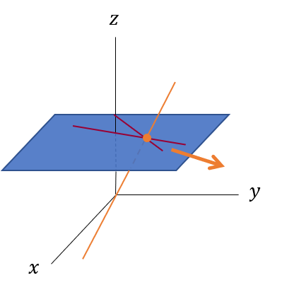

# 射影平面をいくつかの方法で図示してみる

こんにちはSolKulです。

今、この参考書で多視点幾何学について勉強しています。

Multiple View Geometry in Computer Vision
Second Edition  
https://www.robots.ox.ac.uk/~vgg/hzbook/

この参考書のPrefaceの1.1での射影幾何学、射影平面についての説明が出てきますが、最初読んだとき訳が分かりませんでした。分かりにくい原因は幾何学の理論を図なしで言葉だけで説明しようとしているためだと思われます。その後いろいろ調べ、射影空間のうち二次元射影空間である射影平面について、いくつかの方法で図示できることがわかったのでメモしておきます。

## 射影空間の導入

普段我々が慣れ親しんでいる空間の取り扱い方は、ユークリッド幾何学と呼ばれます。平面上の座標を$(x,y)$と2つの数で表すようなやり方です。しかし、このユークリッド幾何学には一つ大きな欠点があります。それは「2つの直線は1点で交わる」という法則に例外を作らないといけないという点です。その例外というのは平行です。平行な直線同士はどこまで行っても交わりません。

例外を回避するために、平行な直線は無限遠の点で交わると定義すればいいかもしれませんが、今度は無限遠の点が厳密に定義できません。このようなユークリッド幾何学の欠点を解決するために、ユークリッド空間に加えて無限遠の点も考慮する空間を考えます。これを射影空間と呼びます。

具体的には、通常、ユークリッド2次元空間上の点は$(x,y)$で表せられますが、射影空間ではそこに1つ座標を加えて$(x,y,1)$と表すことにします。また、3つの数の組で表せられる射影空間の座標は定数倍しても同じものを表すと定義します。つまり$(x,y,1)$も$(2x,2y,2)$も同じ点を表します。数学的に正式には、「定数倍した3つの数の組の座標同士が同値であるとしたとき、ユークリッド平面の点はの3つの数の組の座標の同値類(equivalent class)で表せられる」と言います。このような座標のことを同次座標(homogeneous coordinate)と呼びます。

$(x,y,1)$は最後の$1$を除くことでいつでも$(x,y)$ともとのユークリッドの表現に戻すことができますが、$(x,y,0)$についてはどうでしょう？これに対応するもとのユークリッドの座標は存在しません。もし、最後の3つの目の座標で、前2つの座標を割ろうとすれば、$(x/0,y/0)$となり、これは無限になります。こうして考慮に入れたかった無限遠の点が現れてくのです。

以上のことはどんな次元でも同様で、ユークリッド空間$\mathbb{R}^n$は、点を同次ベクトルとして表すことで、射影空間$\mathbb{P}^n$に拡張する事ができます。また、先程出てきた無限遠点は$\mathbb{P}^2$では直線となることが明らかになります。それを無限遠直線(The line at infinity)と呼びます。また、3次元射影空間$\mathbb{P}^3$では無限遠点は無限遠平面(The plane of infinity)となります。

## 射影平面の図示

射影平面$\mathbb{P}^2$はユークリッド平面を拡張した概念なので、図示の仕方は1通りではありません。ここではいくつかの図示の方法を示します。

### 平らな地面を撮った写真

ユークリッド空間にとって無限遠点は特別な存在でしたが、射影空間では無限遠点も考慮に入れているので、なんら特別でなく、すべての点は等しく扱われます。また平行線というのは無限遠点で交わる線です。よって無限遠点が特別な点ではないので、射影空間では線の平行性の概念はありません。 平行であることは射影幾何学の概念ではないと言えます。

このことを頭に入れて、図を書いてみます。図を書く手順は、白い紙を用意し、それが無限に広がっていると想像します。これが射影平面$\mathbb{P}^2$だと考えるのです。まず、

1. 紙に直線を描き、これが無限遠直線であることを宣言します。無限遠点は特別な存在ではないので、紙の上に適当に書いてもいいはずです。

2. 次に、この無限遠直線で交差する他の2本の線を描画します。それらは「無限遠直線」で出会うので、平行であると定義できます。(さっき平行の概念はないといったのに、平行を定義しているのはなんか変ですが、細かいことは気にしないようにします。)

これを図示すると以下のようになります。

どう見ても平行ではない線を平行だと定義する、おかしな図になってしまっています。しかし皆さんはこのようなおかしな状況を1度は目にした事はあるのではないでしょうか。

“Railroad tracks "vanishing" into the distance” by MikeMalak – 投稿者自身による作品. Licensed under パブリック・ドメイン via ウィキメディア・コモンズ.

実はこの図は平らな地面を写真を撮ったときと同じようなものです。無限遠点は水平線上に存在します。そして線路のような地面の上では平行な2つの直線は写真上では水平線上で交わるように見えます。かなり強引な解釈すれば、地面というユークリッド平面を、写真という射影平面に射影したとも言えなくもないです。

### 平面に単純に無限遠点を加える

先程は平行でない線を平行と定義してしまいましたが、今度は平行は平行のままで図示する方法です。

平面とその周りに円を書きます。この円を無限遠直線とします。平面に平行な線を書いてみます。そしてその平行な線は無限遠点で交わるのですから、周りの円の上にその平行な直線に対応する無限遠点が一つあるはずです。別の方向の平行な直線についても対応する無限遠点が無限遠直線上にあります。

直線が途中で無理やり折れ曲がっていたり、無限遠直線が曲がっていたりとこれも少し変な図になっています。

### 半球を貼り合わせたもの

いままでの図示では平行や無限遠点が出てきてしまっていました。本来、射影平面ではすべての点は等しく扱われ、平行という概念はないはずです。そのような図示の仕方を考えます。

半球を考えます。半球にまっすぐな線をひこうとすると、球に沿って曲がってしまいますが、半球の上に立っている小人から見ればほぼ直線です。また半球は貼り合わさられており(図示できないですが)、半球の端の点は反対側の端の点と同一視します。オレンジの直線は半球の端で反対側のオレンジの点にワープする感じです。そしてこの半球上の2つの直線は必ず一点で交わります。

この考え方であれば、平行も無限遠点も出てこず、すべての点と直線は等しく扱えます。

### 3次元空間で原点を通る直線
今度は、「射影空間の導入」の節で説明した同次座標をそのまま表す方法です。

まず3次元空間を考え、ユークリッド平面を$z=1$の平面に対応させます。ユークリッド平面上の点を図のように3次元空間上の原点を通る直線に対応させます。説明したように、射影平面では「定数倍した3つの数の組の座標同士が同値であるとしたとき、ユークリッド平面の点はの3つの数の組の座標の同値類(equivalent class)で表せられる」と言いました。この直線は定数倍した3つの数の組の座標の集合ですので、これがまさに同値類です。

そして平行とその交点はどうなるのでしょうか？まず、下図のように2つ直線の交点を考えてみます。この図示の方法ではこの交点は原点を通る直線に対応します。この2つの直線を徐々に平行に近づけていくとどうなるでしょうか？その交点は矢印の方向へ向かうように思えます。

そして最終的に2つの直線が平行になると、交点に対応する直線は、$z=0$の平面上に横倒しになるように思えます。

この$z=0$の平面上の直線がユークリッド平面にとっての無限遠点となります。これは同次座標の$(x,y,0)$が無限遠点だと説明したこととも一致します。

そしてこの図示の方法を使えば無限遠点の集合が直線になることも説明できます。直線がユークリッド平面の点に対応するのですから、平面はユークリッド平面の直線に対応するはずです。実際、原点を通る平面をと$z=1$の平面が交差を考えればそれは直線となります。そして先ほど説明した無限遠点に対応する$z=0$の平面上の直線を集めれば、$z=0$平面となります。平面はユークリッド平面での直線に対応するのですから、無限遠点の集合は直線、つまり無限遠直線(The line at infinity)となります。

この最後の図示の方法は同次座標との対応が取れるので厳密な議論に向いているそうです。

## 終わりに

もっと射影空間を理解したかったのなら多様体の教科書をよんだほうがいいかもしれません。私もこの記事を書いている途中でこれらの図示をする時間があればその時間を使って多様体の教科書を読んだほうがいいんじゃないかと思い始めました。しかし、個人的にきれいな図を残して知識を整理してみたかったのでこの記事を作ってみました。

射影空間について理解したいときに参考になれば幸いです。

## 参考にしたサイト

https://mathtrain.jp/projectiveplane